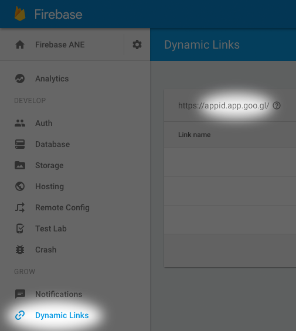

# Firebase Invites | Native extension for Adobe AIR (iOS &amp; Android)

[Firebase Invites](https://firebase.google.com/docs/invites/) is a cross-platform solution for sending personalized email and SMS invitations, on-boarding users, and measuring the impact of invitations. Word of mouth is one of the most effective ways of getting users to install your app. Firebase Invites makes it easy to turn your app's users into your app's strongest advocates.

Development of this extension is supported by [Master Tigra, Inc.](https://github.com/mastertigra)

## Features

* Receiving Firebase invitations and associated deep links
* Sending invitations via native UI

## Firebase Invites SDK versions

* iOS `v1.1.0`
* Android `v9.4.0`

## Getting started

### Prerequisites

FirebaseInvites extension requires [FirebaseConfig](https://github.com/marpies/firebase-config-ane) and [FirebaseCore](https://github.com/marpies/firebase-core-ane) extensions. See the instructions for each extension and add them to your project.

For iOS support, copy the frameworks from [bin/ios-frameworks](bin/ios-frameworks) to `AIR_SDK_LOCATION/lib/aot/stub` directory on your computer.

If you plan on sending invitations from iOS, your users will need to be signed in into your app with their Google account. To add this feature to your app, you can use [Google Identity extension developed by distriqt](http://airnativeextensions.com/extension/com.distriqt.GoogleIdentity).

### Additions to AIR descriptor

After you deal with the prerequisites, add the extension's ID to the `extensions` element.

```xml
<extensions>
    <extensionID>com.marpies.ane.firebase.invites</extensionID>
</extensions>
```

If you are targeting Android, add the following extensions from [this repository](https://github.com/marpies/android-dependency-anes) as well (unless you know these libraries are included by some other extensions):

```xml
<extensions>
    <extensionID>com.marpies.ane.androidsupport</extensionID>
    <extensionID>com.marpies.ane.googleplayservices.base</extensionID>
    <extensionID>com.marpies.ane.googleplayservices.appinvite</extensionID>
</extensions>
```

For iOS support, look for the `iPhone` element and make sure it contains the following `InfoAdditions` and `Entitlements`:

```xml
<iPhone>
    <InfoAdditions>
        <![CDATA[
        <key>CFBundleURLTypes</key>
            <array>
                <dict>
                    <key>CFBundleURLName</key>
                    <string>{APP-PACKAGE-NAME}</string>
                    <key>CFBundleURLSchemes</key>
                    <array>
                        <string>{APP-PACKAGE-NAME}</string>
                        <string>{REVERSED_CLIENT_ID}</string>
                    </array>
                </dict>
            </array>
            
            <key>MinimumOSVersion</key>
            <string>7.0</string>
            ]]>
        </InfoAdditions>

        <Entitlements>
            <![CDATA[
            <key>com.apple.developer.associated-domains</key>
            <array>
                <string>applinks:{DYNAMIC-LINK-DOMAIN}</string>
            </array>
            ]]>
        </Entitlements>

    <requestedDisplayResolution>high</requestedDisplayResolution>
</iPhone>
```

In the snippet above, replace:
* `{APP-PACKAGE-NAME}` with your app package name (value of `id` element in your AIR app descriptor).
* `{REVERSED-CLIENT-ID}` with your `REVERSED_CLIENT_ID` value from your `GoogleService-Info.plist` file. The value starts with `com.googleusercontent.apps`.
* `{DYNAMIC-LINK-DOMAIN}` with your Dynamic Link domain value from the Firebase project console (see image below). The value must be without `https://` and the trailing slash so that the value of the entitlement will look like this: `applinks:appid.app.goo.gl`



For Android support, modify `manifestAdditions` element so that it contains the following:

```xml
<android>
    <manifestAdditions>
        <![CDATA[
        <manifest android:installLocation="auto">

            <application>
                <!-- FirebaseInvites BEGIN -->
                <activity 
                    android:name="com.marpies.ane.firebase.invites.FirebaseInviteActivity"
                    android:theme="@android:style/Theme.Translucent.NoTitleBar.Fullscreen"
                    android:configChanges="keyboard|keyboardHidden|screenLayout|screenSize|orientation"
                />
                <activity>
                    <intent-filter>
                         <action android:name="android.intent.action.MAIN"/>
                         <category android:name="android.intent.category.LAUNCHER"/>
                    </intent-filter>
                    <intent-filter>
                        <action android:name="android.intent.action.VIEW" />
                        <category android:name="android.intent.category.DEFAULT" />
                        <category android:name="android.intent.category.BROWSABLE" />
                        <data android:host="{DEEP-LINK-HOST}" android:scheme="{DEEP-LINK-SCHEME}" />
                    </intent-filter>
                </activity>
                <!-- FirebaseInvites END -->

            </application>

        </manifest>
        ]]>
    </manifestAdditions>
</android>
```

In the snippet above, replace:
* `{DEEP-LINK-HOST}` with the host which your invitation deeplinks will refer to, for example if one of your deeplinks is `https://example.com/page/cooking` then the host will be `example.com`.
* `{DEEP-LINK-SCHEME}` with your deeplink scheme, usually `http` or `https`.

You may add more than one pair of host and scheme.

Finally, add the [FirebaseInvites ANE](bin/com.marpies.ane.firebase.invites.ane) or [SWC](bin/com.marpies.ane.firebase.invites.swc) package from the [bin directory](bin/) to your project so that your IDE can work with it. The additional Android library ANEs are only necessary during packaging.

## API overview

### Callbacks

To be notified when an invitation is received, specify a callback method that accepts single parameter of type `FirebaseInvitation`:

```as3
FirebaseInvites.addInvitationReceivedCallback( onFirebaseInvitationReceived );
...
private function onFirebaseInvitationReceived( invitation:FirebaseInvitation ):void {
    trace( invitation.id );
    trace( invitation.deepLink );
    trace( invitation.matchType );
}
```

It is recommended to add the callback before initializing the extension to receive any invitations which result in launching your app.

You can add more than one callback, or remove specific callback using:

```as3
FirebaseInvites.removeInvitationReceivedCallback( onFirebaseInvitationReceived );
```

### Initialization

Now proceed with ANE initialization. The `init` method should be called in your document class' constructor, or as early as possible after your app's launch and **after** `FirebaseCore.configure()` is called:

```as3
if( FirebaseInvites.init() ) {
    // successfully initialized
}
```

You may pass in `true` to the `init` call to enable extension logs.

### Sending invitations

To send a Firebase invitation, use `FirebaseInvites.dialog` getter. It is a [builder object](https://en.wikipedia.org/wiki/Builder_pattern) that can be used to predefine values for an invitation dialog which is presented using native UI:

```as3
FirebaseInvites.dialog
    .setTitle( "Invitation title" )
    .setMessage( "Hi, try this cooking app!" )
    .setAppDescription( "App description in email" ) // iOS only
    .setCallToActionText( "INSTALL NOW!" ) // Email call-to-action button label
    .setCustomImageURL( "https://example.com/custom-image.png" )
    .setDeepLink( "https://example.com/page/cooking" )
    .setErrorCallback( onFirebaseInviteError )
    .setSuccessCallback( onFirebaseInviteSuccess )
    .open();
```

You should specify both error and success callbacks with the following signature:

```as3
private function onFirebaseInviteError( errorMessage:String ):void {
    trace( "FirebaseInvites | onFirebaseInviteError:", errorMessage );
}

private function onFirebaseInviteSuccess( invitationIds:Vector.<String> ):void {
    trace( "FirebaseInvites | onFirebaseInviteSuccess invitation ids:", invitationIds );
}
```

For a complete set of parameters for the dialog, see the included [docs](docs/) for [FirebaseInvitesDialogBuilder class](actionscript/src/com/marpies/ane/firebase/invites/FirebaseInvitesDialogBuilder.as).

## Requirements

* iOS 8+ (You can build for iOS 7 but the FirebaseInvites functionality will not be available)
* Android 4+
* Adobe AIR 20+

## Documentation
Generated ActionScript documentation is available in the [docs](docs/) directory, or can be generated by running `ant asdoc` from the [build](build/) directory.

## Build ANE
ANT build scripts are available in the [build](build/) directory. Edit [build.properties](build/build.properties) to correspond with your local setup.

## Author
The ANE has been written by [Marcel Piestansky](https://twitter.com/marpies) and is distributed under [Apache License, version 2.0](http://www.apache.org/licenses/LICENSE-2.0.html).

## Changelog

#### August 16, 2016 (v1.0.0)

* Public release
